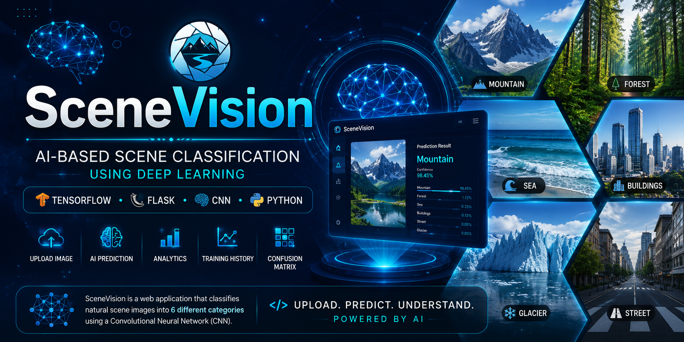

<p align="center">
  
</p>

# 🌍 SceneVision

### AI-Based Scene Classification using Deep Learning
> **AI-Based Natural Scene Classification Web Application using TensorFlow, Keras, and Flask**

SceneVision is a web-based Artificial Intelligence application capable of classifying natural scene images into six different categories using a Convolutional Neural Network (CNN). Users can upload an image, and the trained deep learning model will automatically predict the scene category along with the confidence score.

---

## 🚀 Features

- 📤 Upload image from local device
- 🤖 AI Scene Classification
- 🧠 Convolutional Neural Network (CNN)
- 📊 Confidence Score Prediction
- 📈 Training History Visualization
- 📉 Confusion Matrix
- 📂 Dataset Analytics
- ⚡ Fast TensorFlow Inference
- 🎨 Responsive User Interface

---

## 🛠️ Tech Stack

| Category | Technology |
|-----------|------------|
| Language | Python |
| Backend | Flask |
| AI Framework | TensorFlow |
| Deep Learning | Keras |
| Frontend | HTML5, CSS3, JavaScript |
| Model | CNN |

---

## 🖼️ Application Preview

### Home Page

> *(Add homepage screenshot here)*

---

### Prediction Result

> *(Add prediction result screenshot here)*

---

## 🧠 AI Workflow

```
Image Upload
      │
      ▼
Image Preprocessing
      │
      ▼
CNN Model Prediction
      │
      ▼
Softmax Classification
      │
      ▼
Prediction Result
```

---

## 📂 Dataset

This project uses the **Intel Image Classification Dataset** consisting of six natural scene categories.

- 🏢 Buildings
- 🌲 Forest
- ❄️ Glacier
- ⛰️ Mountain
- 🌊 Sea
- 🛣️ Street

---

## 📈 Training Result

The CNN model was trained using TensorFlow and Keras.

The training process includes:

- Training Accuracy
- Validation Accuracy
- Training Loss
- Validation Loss
- Confusion Matrix

---

## 📁 Project Structure

```
SceneVision

│
├── models/
│   ├── scene_classifier.keras
│   ├── class_indices.json
│   └── model_metadata.json
│
├── static/
│   ├── css/
│   ├── js/
│   ├── images/
│   └── assets/
│
├── templates/
│   └── index.html
│
├── app.py
├── requirements.txt
├── README.md
└── LICENSE
```

---

## ⚙️ Installation

Clone the repository

```bash
git clone https://github.com/YGG0/TBPrakAI_SceneVision.git
```

Go to project folder

```bash
cd TBPrakAI_SceneVision
```

Install dependencies

```bash
pip install -r requirements.txt
```

Run Flask

```bash
python app.py
```

Open browser

```
http://127.0.0.1:5000
```

---

## 🎯 Model Information

| Property | Value |
|----------|-------|
| Model | CNN |
| Framework | TensorFlow |
| Library | Keras |
| Classes | 6 |
| Output | Softmax |

---

## 🎨 User Interface

- Modern Landing Page
- Responsive Design
- Animated Components
- Dataset Visualization
- AI Prediction Interface

---

## 🔮 Future Development

- 🎥 Video Classification
- 📷 Webcam Prediction
- 🌐 REST API
- ☁️ Cloud Deployment
- 📱 Mobile Version

---

## 👨‍💻 Author

**Rezha (YGG0)**

GitHub

https://github.com/YGG0

---

## 📄 License

This project is distributed under the MIT License.

---

# ⭐ If you like this project, don't forget to give it a Star!
